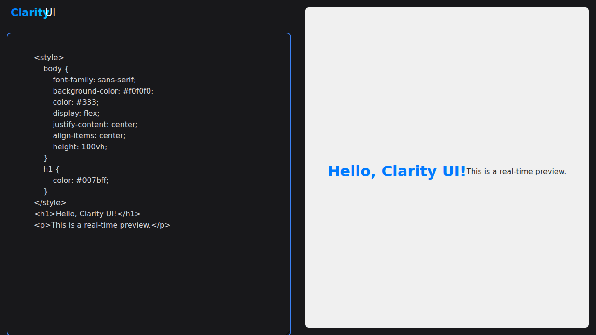

<p align="center">
  
</p>

# Clarity UI Studio

**Clarity UI Studio** is a web-based application designed to accelerate the creation of beautiful, consistent web pages and components. It provides a powerful yet simple interface for developers and designers to build UIs declaratively using a predefined design system, and then export the results into production-ready React (Next.js) code.

## Screenshot



## The Vision

- **Rapid Creation:** Quickly build web pages using a GUI or by directly editing the underlying JSON structure.
- **Systematic Design:** Enforce a consistent design system (colors, fonts, spacing, animations) across all applications within the organization.
- **Flexible Workflow:** Cater to both non-programmers via a user-friendly interface and power-users who prefer a code-centric approach.

---

## Tech Stack

- **Monorepo:** Turborepo
- **Package Manager:** npm
- **Framework:** Next.js 15.4+
- **Styling:** Tailwind CSS
- **State Management:** Zustand
- **UI Library:** A custom library (`@acme/ui`) inspired by shadcn/ui.
- **Text Editor:** Monaco Editor
- **Data Persistence:** JSONBin.io for template storage.

---

## Project Structure

This project is a monorepo managed by Turborepo.

- `apps/studio`: The main web application for the UI builder.
- `apps/web`: (Optional) An example web application that consumes the `@acme/ui` package.
- `packages/ui`: The core UI component library.
- `packages/tsconfig`: Shared TypeScript configurations.
- `packages/eslint-config-acme`: Shared ESLint configurations.

---

## Getting Started

Follow these steps to set up the development environment.

### Prerequisites

- Node.js (v18.x or later)
- npm (v9.x or later)

### 1. Clone the Repository

```bash
git clone <your-repository-url>
cd <your-repository-name>
```

### 2. Install Dependencies

Install all dependencies for all packages and apps from the root directory.

```bash
npm install
```

### 3. Environment Variables

Create a `.env.local` file in the `apps/studio` directory by copying the example file:

```bash
cp apps/studio/.env.local.example apps/studio/.env.local
```

Then, fill in the required values in `apps/studio/.env.local`:

- `NEXT_PUBLIC_JSONBIN_API_KEY`: Your master API key for JSONBin.io. This is required for saving and loading templates and for logging errors.
- `NEXT_PUBLIC_JSONBIN_ERROR_LOG_BIN_ID`: The ID of the bin where error logs will be stored.

### 4. Run the Development Server

Run the development server for the `studio` application. Turborepo will automatically manage dependencies and build processes.

```bash
npm run dev
```

The `studio` app will be available at `http://localhost:3000`.

---

## Available Scripts

- `npm run dev`: Start the development servers for all apps.
- `npm run build`: Build all apps and packages for production.
- `npm run lint`: Lint all code in the monorepo.
- `npm run clean`: Clean up all `node_modules` and build artifacts.
